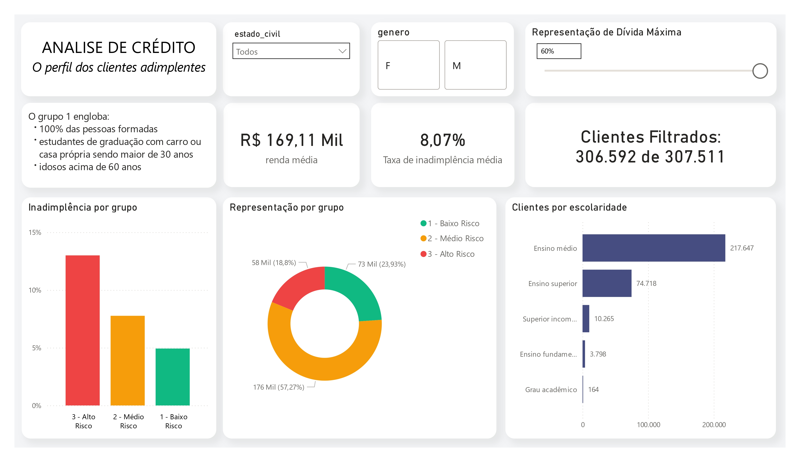
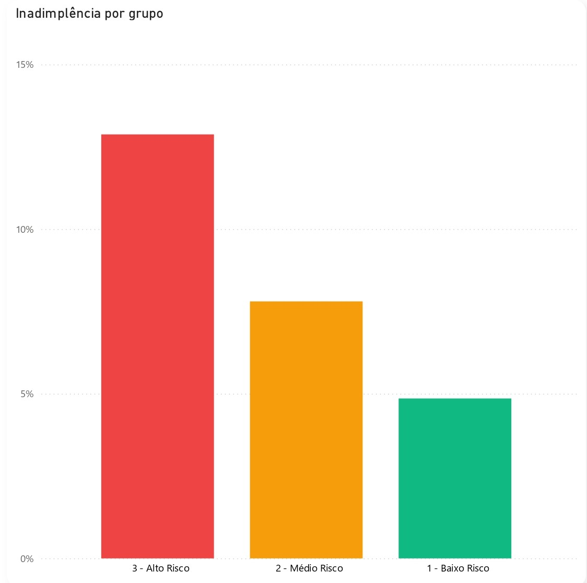

# 🏦 Pipeline End-to-End para FinTechs: Análise de Risco de Crédito

## 📌 Resumo Executivo
Utilizando **Python, PostgreSQL e Power BI**, construí um pipeline completo de dados para analisar o comportamento de crédito de mais de 300 mil clientes. O objetivo foi mapear o risco de inadimplência e otimizar a tomada de decisão. 

A análise revelou padrões claros de comportamento, permitindo segmentar os clientes em faixas de risco. Descobrimos que focar em um "Grupo Ouro" específico pode reduzir a inadimplência em até **3 vezes** comparado ao grupo de alto risco. O projeto entregou uma base de dados otimizada e um dashboard automatizado para a diretoria.

---

## 🎯 Problema de Negócio
Instituições financeiras perdem milhões anualmente devido à inadimplência. O desafio das equipes de crédito e vendas é: **como identificar rapidamente quem são os bons e os maus pagadores antes de aprovar o crédito?**

Precisávamos não apenas analisar o histórico desses clientes, mas criar um modelo de dados performático que entregasse essas respostas de forma instantânea para os analistas de negócio, sem sobrecarregar as ferramentas de visualização.

---

## ⚙️ Metodologia
O projeto foi executado focado em estabilidade e performance corporativa:

1. **Ingestão Robusta (Python):** Extração e carregamento de dados em "blocos" (*chunks*) no banco de dados para evitar travamentos de servidor em grandes volumes.
2. **Transformação e Investigação (SQL):** Limpeza (ETL) e Análise Exploratória (EDA) investigativa diretamente no banco, cruzando renda, escolaridade e bens.
3. **Modelagem de Dados (ABT):** Criação de uma *Analytical Base Table* (ABT) no PostgreSQL. Transferir a carga de processamento para o banco entrega indicadores pré-calculados e garante um dashboard extremamente rápido no BI.
4. **Visualização:** Construção de um painel gerencial no Power BI focado na clareza e experiência do usuário.

---

## 🛠️ Habilidades Técnicas
* **SQL (PostgreSQL):** *Window Functions* (`OVER`, `PARTITION BY`, `NTILE`), *CTEs*, Criação de *Views* e Modelagem Dimensional.
* **Python:** `Pandas` (Manipulação), `SQLAlchemy` (Conexão BD), Processamento em *Chunks*, Tratamento de exceções.
* **Power BI:** DAX, Modelagem de Dados, *Storytelling* Visual, Otimização de performance.

---

## 📊 Resultados e Recomendações de Negócios

Através da modelagem, segmentamos os clientes em 3 grupos de risco. Descobrimos que o **Grupo 1 (Baixo Risco)** — pessoas com ensino superior e bens, ou idosos acima de 60 anos — representa **~24% da base**, com uma taxa de inadimplência de apenas **4,9%**. 

Em contrapartida, o Grupo 3 (Alto Risco) chega a **13%** de inadimplência, quase o triplo do risco.

**Recomendações Estratégicas:**
* **Aprovação Automática:** Criar uma "esteira rápida" para clientes do Grupo 1, possivelmente oferecendo taxas de juros mais atrativas para fidelizá-los.
* **Análise Rigorosa:** Clientes do Grupo 3 devem passar por análise humana mais criteriosa ou exigir garantias adicionais (fiadores/colateral) antes da liberação.

---

## 🚀 Próximos Passos
Se o projeto fosse expandido, as próximas ações seriam:
1. **Orquestração de Dados:** Implementar o *Apache Airflow* para automatizar o script Python com ingestão diária.
2. **Machine Learning:** Utilizar *Scikit-Learn* para criar um modelo de Regressão Logística, prevendo a probabilidade exata de cada CPF se tornar inadimplente.
3. **Testes A/B:** Testar limites de crédito diferentes para o "Grupo 2 (Médio Risco)" para encontrar o ponto de equilíbrio entre lucro e risco.